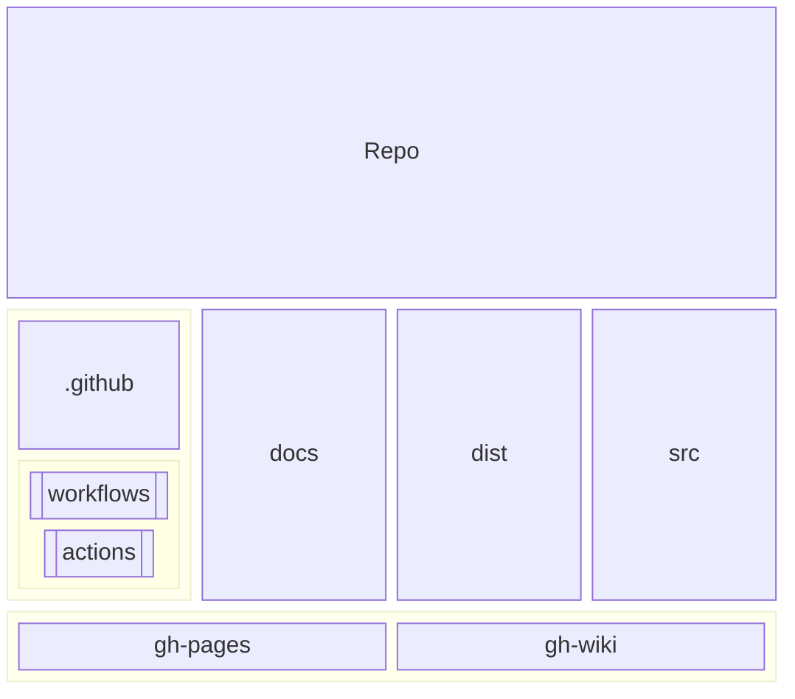
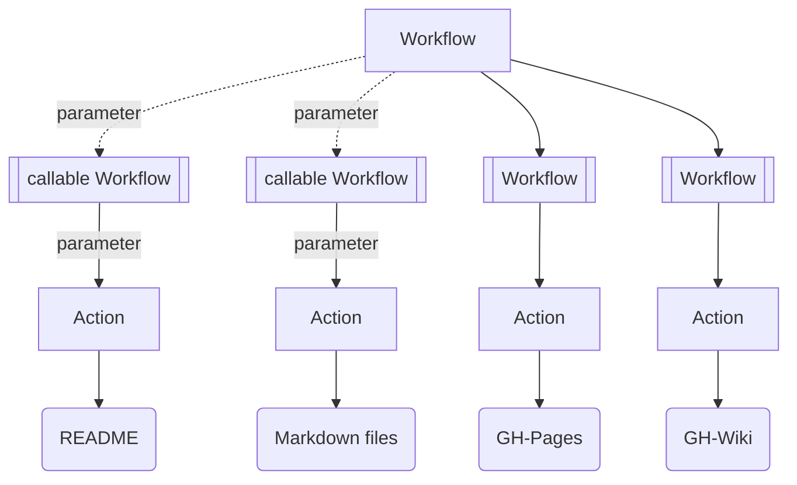
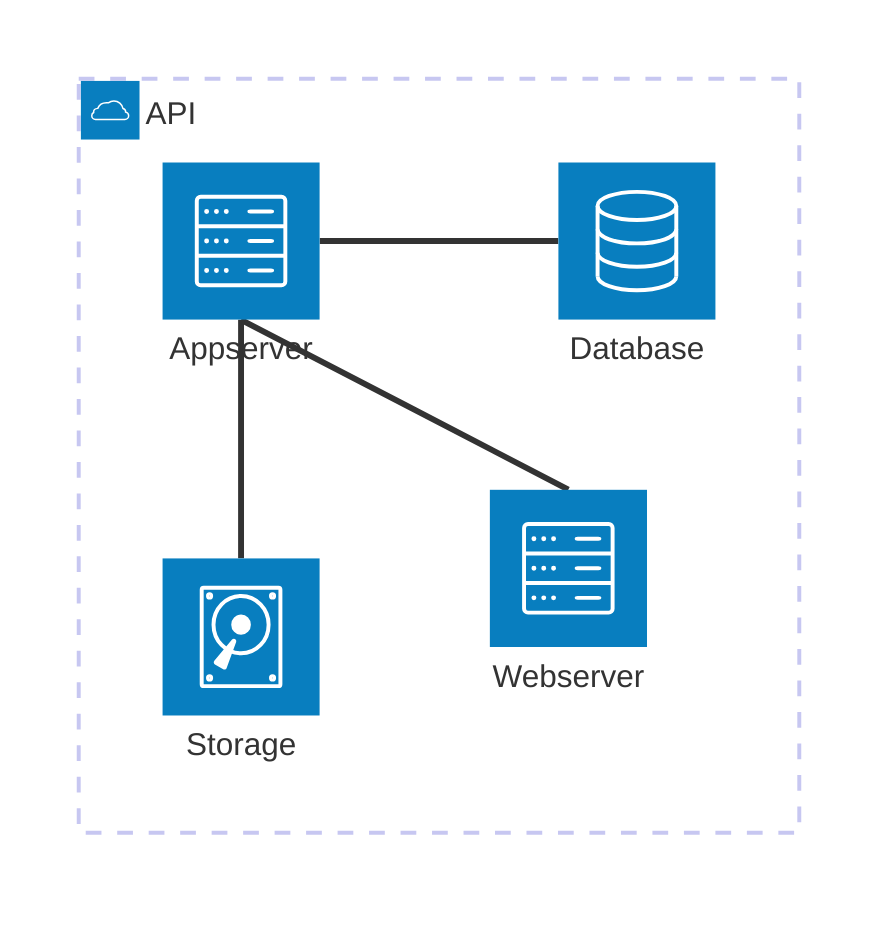
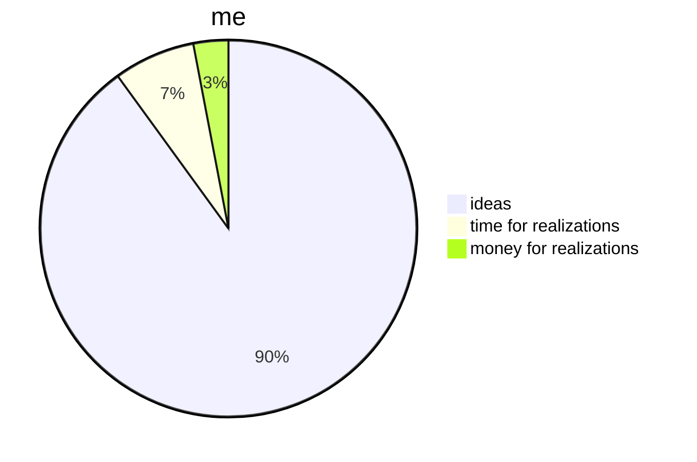

<div id="top" align="center">
<h1>qt_files_photo-gallery</h1>

<p>QT6 CXX20 console app to add photos to PostgreSQL</p>

[Report Issue](https://github.com/Zheng-Bote/qt_files_photo-gallery/issues) [Request Feature](https://github.com/Zheng-Bote/qt_files_photo-gallery/pulls)

[](https://choosealicense.com/licenses/mit/)


</div>

<hr>

<!-- START doctoc generated TOC please keep comment here to allow auto update -->
<!-- DON'T EDIT THIS SECTION, INSTEAD RE-RUN doctoc TO UPDATE -->
**Table of Contents**

- [Description](#description)
    - [Features](#features)
  - [Status](#status)
    - [Application / Tool](#application--tool)
    - [Documentation](#documentation)
      - [README](#readme)
      - [other Markdown files](#other-markdown-files)
- [Installation](#installation)
  - [Dependencies](#dependencies)
      - [cxxopts](#cxxopts)
      - [inifile-cpp](#inifile-cpp)
  - [folder structure](#folder-structure)
  - [Usage/Examples/Tests](#usageexamplestests)
- [API Reference](#api-reference)
  - [Inputs / Parameters](#inputs--parameters)
  - [Outputs](#outputs)
- [Documentation](#documentation-1)
  - [Architecture](#architecture)
    - [Github](#github)
      - [Github Repo](#github-repo)
      - [Github Actions / Workflows](#github-actions--workflows)
  - [Application](#application)
  - [DevOps](#devops)
  - [Github Page](#github-page)
  - [Github Wiki](#github-wiki)
  - [Comments](#comments)
  - [Screenshots](#screenshots)
- [Authors and License](#authors-and-license)
  - [License](#license)
  - [Authors](#authors)
    - [Code Contributors](#code-contributors)

<!-- END doctoc generated TOC please keep comment here to allow auto update -->

<hr>

# Description


QT6 CXX20 console app to add photos to PostgreSQL

### Features

- \[ ] advanced-super-extra-special feature xyz

  <br>

- \[x] OSS and license
- \[x] works as designed
- \[ ] no bugs

<br>

- \[x] some more or less usefull Github Actions for GH-repo, GH-pages, GH-wiki, CI/CD-Pipelines
- \[x] CMake
- \[ ] Installation routine
- \[ ] portable application

<br>

- \[ ] runs on DOS/Windows
- \[ ] runs on MacOS
- \[x] runs on Linux
- \[ ] runs on iOS
- \[ ] runs on Android
- \[ ] runs on HarmonyOS

<p align="right">(<a href="#top">back to top</a>)</p>

## Status

### Application / Tool


### Documentation

_see also:_ [Application Documentation](#documentation)

#### README

[](https://github.com/Zheng-Bote/qt_files_photo-gallery/actions/workflows/repo-create_tree_readme.yml)

[](https://github.com/Zheng-Bote/qt_files_photo-gallery/actions/workflows/repo-call_Readme.yml)

#### other Markdown files

[](https://github.com/Zheng-Bote/qt_files_photo-gallery/actions/workflows/repo-create_doctoc_md.yml)

create ToC in Markdown files in folders

- .github/actions/\*\*
- .github/workflows/\*\*
- dist/\*\*
- docs/\*\*

<p align="right">(<a href="#top">back to top</a>)</p>

# Installation

bla bla ... everything easy and green with No Code/Low code and without any costs

## Dependencies

#### cxxopts

a lightweight C++ option parser library, supporting the standard GNU style syntax for options.

[](https://github.com/jarro2783/cxxopts)

[](https://choosealicense.com/licenses/mit/)

#### inifile-cpp

inifile-cpp is a simple and easy to use single header-only ini file en- and decoder for C++.

[](https://github.com/Rookfighter/inifile-cpp)

[](https://choosealicense.com/licenses/mit/)

## folder structure

<!-- readme-tree start -->
```
.
├── .github
│   ├── actions
│   │   └── doctoc
│   │       ├── README.md
│   │       ├── action.yml
│   │       └── dist
│   │           ├── index.js
│   │           ├── index.js.map
│   │           ├── licenses.txt
│   │           └── sourcemap-register.js
│   └── workflows
│       ├── repo-actions_docu.yml
│       ├── repo-call_Readme.yml
│       ├── repo-create_doctoc.yml_
│       ├── repo-create_doctoc_md.yml
│       └── repo-create_tree_readme.yml
├── .gitignore
├── LICENSE
├── README.md
├── dist
│   └── qt_files_photo-gallery.ini
├── src
│   ├── CMakeLists.txt
│   ├── build
│   │   └── Desktop_Qt_6_6_1_GCC_64bit-Debug
│   │       ├── .cmake
│   │       │   └── api
│   │       │       └── v1
│   │       │           ├── query
│   │       │           │   ├── cache-v2
│   │       │           │   ├── cmakeFiles-v1
│   │       │           │   └── codemodel-v2
│   │       │           ├── reply
│   │       │           │   ├── cache-v2-119df5e51e2f543880d8.json
│   │       │           │   ├── cmakeFiles-v1-c714eca295185fd1ba5f.json
│   │       │           │   ├── codemodel-v2-28fc646d8018ff7fe731.json
│   │       │           │   ├── directory-.-Debug-d1dccb8230f7aa386c0c.json
│   │       │           │   ├── index-2024-09-21T09-08-50-0873.json
│   │       │           │   ├── target-qt_files_photo-gallery-Debug-bd6e11cd8eeb67dcf229.json
│   │       │           │   ├── target-qt_files_photo-gallery_autogen-Debug-9e7f36bd7602a37527a5.json
│   │       │           │   └── target-qt_files_photo-gallery_autogen_timestamp_deps-Debug-483c2d2bf728f51ff144.json
│   │       │           └── reply.prev
│   │       │               ├── cache-v2-119df5e51e2f543880d8.json
│   │       │               ├── cmakeFiles-v1-3bcd0d7524c8c67f505d.json
│   │       │               ├── codemodel-v2-267db0dea1d1a3a0c3b3.json
│   │       │               ├── directory-.-Debug-061b6f4faa342d6b0e96.json
│   │       │               ├── index-2024-09-21T09-07-26-0877.json
│   │       │               ├── target-qt_files_photo-gallery-Debug-b3bf0139e1ae8fd66169.json
│   │       │               ├── target-qt_files_photo-gallery_autogen-Debug-9e7f36bd7602a37527a5.json
│   │       │               └── target-qt_files_photo-gallery_autogen_timestamp_deps-Debug-483c2d2bf728f51ff144.json
│   │       ├── .qt
│   │       │   └── QtDeploySupport.cmake
│   │       ├── .qtc
│   │       │   └── package-manager
│   │       │       ├── LICENSE.conan
│   │       │       ├── auto-setup.cmake
│   │       │       ├── conan.cmake
│   │       │       └── conan_provider.cmake
│   │       ├── .qtc_clangd
│   │       │   ├── .cache
│   │       │   │   └── clangd
│   │       │   │       └── index
│   │       │   │           ├── FILE.h.79AEFC497861DFC5.idx
│   │       │   │           ├── QCoreApplication.DDE40AB7908132F7.idx
│   │       │   │           ├── QDebug.0C2A7FB52A07C43E.idx
│   │       │   │           ├── QDir.554DE782BD771820.idx
│   │       │   │           ├── QDirIterator.C73A768A4312A5AB.idx
│   │       │   │           ├── QFile.DECF70DF1217624E.idx
│   │       │   │           ├── QString.770381E5BA1B29AE.idx
│   │       │   │           ├── __FILE.h.3324F85E382E036A.idx
│   │       │   │           ├── __fpos64_t.h.23C43F442076149A.idx
│   │       │   │           ├── __fpos_t.h.ECFBE9EEDAAB6648.idx
│   │       │   │           ├── __locale_t.h.40EA38A2DCA58618.idx
│   │       │   │           ├── __mbstate_t.h.6C32CF66236653D7.idx
│   │       │   │           ├── __sigset_t.h.72131E8056C7E284.idx
│   │       │   │           ├── __stdarg___gnuc_va_list.h.F0469ABEC63FC438.idx
│   │       │   │           ├── __stdarg___va_copy.h.924C7D6C556E5A30.idx
│   │       │   │           ├── __stdarg_va_arg.h.01D7221DB3DB5C79.idx
│   │       │   │           ├── __stdarg_va_copy.h.4F9E107555B09333.idx
│   │       │   │           ├── __stdarg_va_list.h.B7A0180F2FB16923.idx
│   │       │   │           ├── __stddef_max_align_t.h.D5FB7C32146F33FF.idx
│   │       │   │           ├── __stddef_null.h.938791EC6ECC42A6.idx
│   │       │   │           ├── __stddef_nullptr_t.h.E7015779563ED222.idx
│   │       │   │           ├── __stddef_offsetof.h.5F0538CB65D237F2.idx
│   │       │   │           ├── __stddef_ptrdiff_t.h.CC6EB734FCAB879C.idx
│   │       │   │           ├── __stddef_size_t.h.E1A12578CF44EBCC.idx
│   │       │   │           ├── __stddef_wchar_t.h.B830CA1E29E27BEA.idx
│   │       │   │           ├── algorithm.1CE1C5E7A2CC8947.idx
│   │       │   │           ├── algorithmfwd.h.7598BC438C9F2E18.idx
│   │       │   │           ├── align.h.EF3672F59F577484.idx
│   │       │   │           ├── aligned_buffer.h.D25F294C09A9BD51.idx
│   │       │   │           ├── alloc_traits.h.888093B2650D973C.idx
│   │       │   │           ├── alloc_traits.h.A03678EA5038239B.idx
│   │       │   │           ├── alloca.h.793370BF9878CFB6.idx
│   │       │   │           ├── allocated_ptr.h.4C2F2E5344DBBE09.idx
│   │       │   │           ├── allocator.h.726B26F70D1E9A82.idx
│   │       │   │           ├── array.F4CC01525F44E658.idx
│   │       │   │           ├── assert.h.9895EEC17E1D2A2B.idx
│   │       │   │           ├── assertions.h.1D646B13C15CF849.idx
│   │       │   │           ├── atomic.659F85E5DD2BCAE5.idx
│   │       │   │           ├── atomic_base.h.BE2CD511127AE324.idx
│   │       │   │           ├── atomic_lockfree_defines.h.2D8FA2BBB9BFE893.idx
│   │       │   │           ├── atomic_wide_counter.h.397D66B6BECC0AA2.idx
│   │       │   │           ├── atomic_word.h.8B32DB244716470B.idx
│   │       │   │           ├── atomicity.h.409EF4C070658F73.idx
│   │       │   │           ├── auto_ptr.h.07E293599CEBBF74.idx
│   │       │   │           ├── basic_file.h.7C2A31CEFF5CDE11.idx
│   │       │   │           ├── basic_ios.h.27244003F745C537.idx
│   │       │   │           ├── basic_ios.tcc.EF4ADC91D44A94B0.idx
│   │       │   │           ├── basic_string.h.4F91164A9845D8E7.idx
│   │       │   │           ├── basic_string.tcc.967E4E5D61DA5282.idx
│   │       │   │           ├── bessel_function.tcc.9171F62D1FC8591A.idx
│   │       │   │           ├── beta_function.tcc.157C17AA6D54605D.idx
│   │       │   │           ├── binders.h.B7909204B7953DFB.idx
│   │       │   │           ├── bit.2A91B049774121D4.idx
│   │       │   │           ├── bitset.E896ED7EC6E83E80.idx
│   │       │   │           ├── byteswap.h.E57FF553A16DFAFC.idx
│   │       │   │           ├── c++allocator.h.00F4CFDD575112F2.idx
│   │       │   │           ├── c++config.h.A139A8B32F03163E.idx
│   │       │   │           ├── c++io.h.4BAB9EF579A97D93.idx
│   │       │   │           ├── c++locale.h.9D67E3B33BDF16E2.idx
│   │       │   │           ├── cctype.76C6F247C1380A5B.idx
│   │       │   │           ├── cdefs.h.E4D450DF98C1338F.idx
│   │       │   │           ├── cerrno.5BD437BDECC7A78D.idx
│   │       │   │           ├── char_traits.h.A86DDC004D15BD88.idx
│   │       │   │           ├── charconv.h.869BEB8F43DFD6D7.idx
│   │       │   │           ├── chrono.21DD8193C9F802BB.idx
│   │       │   │           ├── climits.CEDA74AF679CB63C.idx
│   │       │   │           ├── clocale.5FF46E6760ACF029.idx
│   │       │   │           ├── clock_t.h.65AFE5BA7329BCD4.idx
│   │       │   │           ├── clockid_t.h.5545878511E5BAF1.idx
│   │       │   │           ├── cmath.5492EF8C588C18A0.idx
│   │       │   │           ├── codecvt.665B9366F2F415DB.idx
│   │       │   │           ├── codecvt.h.58C191B0C7E7470B.idx
│   │       │   │           ├── concept_check.h.A4C7BDCF159AD4DF.idx
│   │       │   │           ├── concurrence.h.08E9E50104EBC4C9.idx
│   │       │   │           ├── cookie_io_functions_t.h.5A08066DC7F05542.idx
│   │       │   │           ├── cpp_type_traits.h.B5C50C37F2A36E3F.idx
│   │       │   │           ├── cpu-set.h.B40F3E2869BE4FF9.idx
│   │       │   │           ├── cpu_defines.h.E7463FB44761786A.idx
│   │       │   │           ├── cstddef.287A68F2FBF12AAD.idx
│   │       │   │           ├── cstdint.47B9166DA94B05BD.idx
│   │       │   │           ├── cstdio.325B5C34B96CF05A.idx
│   │       │   │           ├── cstdlib.126A0D14F38BA60B.idx
│   │       │   │           ├── cstring.DBEE10CA3A7F86F4.idx
│   │       │   │           ├── ctime.D0C81AD2723230F7.idx
│   │       │   │           ├── ctype.h.B268CEA0CECCFC59.idx
│   │       │   │           ├── ctype_base.h.061904B491C09A96.idx
│   │       │   │           ├── ctype_inline.h.555F46E334036AFD.idx
│   │       │   │           ├── cwchar.A3402FA4C9A9F672.idx
│   │       │   │           ├── cwctype.0BD24B4889412D8A.idx
│   │       │   │           ├── cxxabi_forced.h.B8AF18F1501F1585.idx
│   │       │   │           ├── cxxabi_init_exception.h.542C953E6C829C53.idx
│   │       │   │           ├── cxxopts.hpp.D3BF29E9211258F2.idx
│   │       │   │           ├── debug.h.F7EBBA6BC88A9949.idx
│   │       │   │           ├── deque.D50F6502652C3DE2.idx
│   │       │   │           ├── deque.tcc.9F4C43E4D6E007D5.idx
│   │       │   │           ├── ell_integral.tcc.28856E23765B109F.idx
│   │       │   │           ├── enable_special_members.h.74E7B224F8375F62.idx
│   │       │   │           ├── endian.h.1FC6A4D6D2846204.idx
│   │       │   │           ├── endian.h.20F8E286A486EE09.idx
│   │       │   │           ├── endianness.h.F2D2CC6251A4EAFA.idx
│   │       │   │           ├── erase_if.h.72B55D60DDD77C56.idx
│   │       │   │           ├── errno-base.h.23FC55A99C73A727.idx
│   │       │   │           ├── errno.h.063064A523A47758.idx
│   │       │   │           ├── errno.h.10013861918E601A.idx
│   │       │   │           ├── errno.h.19BCCCD58DA5623E.idx
│   │       │   │           ├── errno.h.33F6986A3C61A3BF.idx
│   │       │   │           ├── errno.h.3F8ECD84FB880B64.idx
│   │       │   │           ├── error_constants.h.7739DB6650F792ED.idx
│   │       │   │           ├── error_t.h.58D3895A591B592D.idx
│   │       │   │           ├── exception.3BCB02E313BF87C9.idx
│   │       │   │           ├── exception.h.563622B7F9DE0D64.idx
│   │       │   │           ├── exception_defines.h.CED4C5F04DCEC0A5.idx
│   │       │   │           ├── exception_ptr.h.6BAAB8CAEF920B5D.idx
│   │       │   │           ├── execution_defs.h.186F44494DB49E13.idx
│   │       │   │           ├── exp_integral.tcc.3BFA54CF549FBF5E.idx
│   │       │   │           ├── features-time64.h.BFBA8D3CA0316037.idx
│   │       │   │           ├── features.h.5A4ED7C80201A723.idx
│   │       │   │           ├── filesystem.58C5748A3D353804.idx
│   │       │   │           ├── floatn-common.h.0FE8C4DDCB84E088.idx
│   │       │   │           ├── floatn.h.DA21C738CC1B6ABF.idx
│   │       │   │           ├── flt-eval-method.h.8058951BDB657B4B.idx
│   │       │   │           ├── fp-fast.h.72CDF40E7648EF43.idx
│   │       │   │           ├── fp-logb.h.EA7AC5545F14BC26.idx
│   │       │   │           ├── fs_dir.h.2FC666630B5DF1D6.idx
│   │       │   │           ├── fs_fwd.h.D95CB646ECF107A2.idx
│   │       │   │           ├── fs_ops.h.9108421E261AA3B8.idx
│   │       │   │           ├── fs_path.h.F46F5FF75E3F3ED6.idx
│   │       │   │           ├── fstream.C4728DB0AF9DC466.idx
│   │       │   │           ├── fstream.tcc.A0D99CC436FC8ACE.idx
│   │       │   │           ├── functexcept.h.807459FDC2AF6C4E.idx
│   │       │   │           ├── functional.ACE7A23DFA6A7C81.idx
│   │       │   │           ├── functional_hash.h.412E38477D218834.idx
│   │       │   │           ├── gamma.tcc.CA2DC1F3C7EBE19F.idx
│   │       │   │           ├── glue_algorithm_defs.h.C368EC8DE1036B81.idx
│   │       │   │           ├── glue_memory_defs.h.6519B6B389AF4A23.idx
│   │       │   │           ├── glue_numeric_defs.h.FCCD2FC54DA0DE29.idx
│   │       │   │           ├── gthr-default.h.B9D1A861FCC1A40F.idx
│   │       │   │           ├── gthr.h.224F0F09E7E4961C.idx
│   │       │   │           ├── hash_bytes.h.274FC085A1115B4A.idx
│   │       │   │           ├── hashtable.h.DC8C92A807F065D3.idx
│   │       │   │           ├── hashtable_policy.h.40A3B6E69632E8E1.idx
│   │       │   │           ├── hypergeometric.tcc.62C6EC35332E0AAE.idx
│   │       │   │           ├── inicpp.h.D3687FD1098AD28A.idx
│   │       │   │           ├── initializer_list.487DC3AA34672C18.idx
│   │       │   │           ├── invoke.h.DF3BCAA5A6E33E7C.idx
│   │       │   │           ├── iomanip.414DA7D33CD854B2.idx
│   │       │   │           ├── ios.B38D8889254BEAE4.idx
│   │       │   │           ├── ios_base.h.979B6DBB9A7C8F35.idx
│   │       │   │           ├── iosfwd.F621C0E74BE8B067.idx
│   │       │   │           ├── iostream.E821D0534D6195B1.idx
│   │       │   │           ├── iscanonical.h.C53E44E13856FCEA.idx
│   │       │   │           ├── istream.05365CBBF56A286B.idx
│   │       │   │           ├── istream.tcc.2FC04E64BEDF01B3.idx
│   │       │   │           ├── iterator.38B33E1892DEEBB8.idx
│   │       │   │           ├── legendre_function.tcc.64E8C808CA5BAA8E.idx
│   │       │   │           ├── libc-header-start.h.E88219B53B0B0BF5.idx
│   │       │   │           ├── libintl.h.929023AD77A09335.idx
│   │       │   │           ├── libm-simd-decl-stubs.h.06B70A57602EA3C8.idx
│   │       │   │           ├── limits.B12624C6106406AC.idx
│   │       │   │           ├── limits.h.1DFE7D0FE6434B13.idx
│   │       │   │           ├── limits.h.C293B8934AC926BB.idx
│   │       │   │           ├── limits.h.EFF84371BCDC1E6D.idx
│   │       │   │           ├── list.168C0A1C22C8B14B.idx
│   │       │   │           ├── list.tcc.94671DB6D4C8E664.idx
│   │       │   │           ├── local_lim.h.2CFD657F256B117E.idx
│   │       │   │           ├── locale.4A4FC62E683FEE53.idx
│   │       │   │           ├── locale.h.E3C63D05A4E78516.idx
│   │       │   │           ├── locale.h.F1B51844858762D2.idx
│   │       │   │           ├── locale_classes.h.9512D5BF9F8BFC78.idx
│   │       │   │           ├── locale_classes.tcc.A7CA62888BCB33BF.idx
│   │       │   │           ├── locale_conv.h.594035E281DD97F1.idx
│   │       │   │           ├── locale_facets.h.01D2A2C519D2AB29.idx
│   │       │   │           ├── locale_facets.tcc.ADB60AD477680BE5.idx
│   │       │   │           ├── locale_facets_nonio.h.37F06E96BE2238E0.idx
│   │       │   │           ├── locale_facets_nonio.tcc.F44B39F25240969E.idx
│   │       │   │           ├── locale_t.h.557516A6B361170F.idx
│   │       │   │           ├── localefwd.h.A3B7C978BF60EC19.idx
│   │       │   │           ├── long-double.h.ACD735A1862B6BF8.idx
│   │       │   │           ├── main.cpp.E2A28B1D18B8B0AE.idx
│   │       │   │           ├── map.8C22362DDFC69B22.idx
│   │       │   │           ├── math-vector.h.B3EAC58DA1700969.idx
│   │       │   │           ├── math.h.DE4D39AAF5AC2C76.idx
│   │       │   │           ├── mathcalls-helper-functions.h.934C8C52064E404C.idx
│   │       │   │           ├── mathcalls-narrow.h.EF4B0E9378BD4EE1.idx
│   │       │   │           ├── mathcalls.h.655A2220FF0677F8.idx
│   │       │   │           ├── mbstate_t.h.F9237FB65FF84D5A.idx
│   │       │   │           ├── memory.768AFB22B9D6A62F.idx
│   │       │   │           ├── memoryfwd.h.935D7DF208FDC906.idx
│   │       │   │           ├── messages_members.h.C6BEC839235C4768.idx
│   │       │   │           ├── modified_bessel_func.tcc.9B1532CEE9C375E7.idx
│   │       │   │           ├── move.h.89F6D662F9EAEF16.idx
│   │       │   │           ├── nested_exception.h.10DC70ED9F08D9D1.idx
│   │       │   │           ├── new.8A4066321F7AF016.idx
│   │       │   │           ├── new_allocator.h.D9A43F0C582D8F82.idx
│   │       │   │           ├── node_handle.h.CDEC5F05C546600C.idx
│   │       │   │           ├── numeric.C9B73B80E066D1B7.idx
│   │       │   │           ├── numeric_traits.h.71952CE5B96E8B47.idx
│   │       │   │           ├── optional.3D6E41A544334FEE.idx
│   │       │   │           ├── os_defines.h.EA4549991D07B32F.idx
│   │       │   │           ├── ostream.A5DF5DC1205D9124.idx
│   │       │   │           ├── ostream.tcc.BB4B956F95665533.idx
│   │       │   │           ├── ostream_insert.h.8302B2D6873DA4BB.idx
│   │       │   │           ├── parse_numbers.h.A6E2C9E96411584C.idx
│   │       │   │           ├── poly_hermite.tcc.9FD6029D55EB67A1.idx
│   │       │   │           ├── poly_laguerre.tcc.BFD895219AA7B68C.idx
│   │       │   │           ├── posix1_lim.h.D94E4687FC9359FF.idx
│   │       │   │           ├── posix2_lim.h.430DA38A1F301F29.idx
│   │       │   │           ├── postypes.h.6906AFED0EA1F1B4.idx
│   │       │   │           ├── predefined_ops.h.9786B9F84B9462DC.idx
│   │       │   │           ├── pstl_config.h.CBBF88553BC795EF.idx
│   │       │   │           ├── pthread.h.022320E0CE01A46D.idx
│   │       │   │           ├── pthread_stack_min-dynamic.h.6F432801F0DF58B7.idx
│   │       │   │           ├── pthreadtypes-arch.h.9E138C411BE448A0.idx
│   │       │   │           ├── pthreadtypes.h.BAA8217B62BB6E86.idx
│   │       │   │           ├── ptr_traits.h.F78C58E579CDA022.idx
│   │       │   │           ├── q20functional.h.7527B559794C3B18.idx
│   │       │   │           ├── q20memory.h.1F858751392A4497.idx
│   │       │   │           ├── q20type_traits.h.AC9A2C1CFAC51B64.idx
│   │       │   │           ├── q23utility.h.CD7D39ED3A0013BE.idx
│   │       │   │           ├── qalgorithms.h.8F7FA10BA963B1E1.idx
│   │       │   │           ├── qanystringview.h.6624AE891F67220B.idx
│   │       │   │           ├── qarraydata.h.1745CFB7648050E3.idx
│   │       │   │           ├── qarraydataops.h.0FFFD50C3A46F932.idx
│   │       │   │           ├── qarraydatapointer.h.A3AC3A2B8450DE29.idx
│   │       │   │           ├── qassert.h.E9606C706BCBFCA0.idx
│   │       │   │           ├── qatomic.h.CD36F6C7AA4858AE.idx
│   │       │   │           ├── qatomic_cxx11.h.AB3FB321F6AC3E21.idx
│   │       │   │           ├── qbasicatomic.h.8689C982F01BD18B.idx
│   │       │   │           ├── qbindingstorage.h.80A23E92F92956B6.idx
│   │       │   │           ├── qbytearray.h.1D94DF9DB23CA503.idx
│   │       │   │           ├── qbytearrayalgorithms.h.EA9B9BE77CC3552A.idx
│   │       │   │           ├── qbytearraylist.h.7CEA127F5F16BE8D.idx
│   │       │   │           ├── qbytearrayview.h.C346B0E46F207A75.idx
│   │       │   │           ├── qcalendar.h.5AF97F888B1B29EC.idx
│   │       │   │           ├── qchar.h.31992B3057FDD864.idx
│   │       │   │           ├── qcompare.h.68B7FEBAD344CF3B.idx
│   │       │   │           ├── qcompare_impl.h.52CD38A2FBE93DA1.idx
│   │       │   │           ├── qcompilerdetection.h.32335FF84EB7EBC4.idx
│   │       │   │           ├── qconfig.h.C7D2B463C3AA6C74.idx
│   │       │   │           ├── qconstructormacros.h.FEC7407F2CD8B1CE.idx
│   │       │   │           ├── qcontainerfwd.h.6ACFD700A3A53459.idx
│   │       │   │           ├── qcontainerinfo.h.B981F281A7931B04.idx
│   │       │   │           ├── qcontainertools_impl.h.3980D277A909AD1E.idx
│   │       │   │           ├── qcontiguouscache.h.A896B3D7C77BA0B5.idx
│   │       │   │           ├── qcoreapplication.h.854399BB85ED2611.idx
│   │       │   │           ├── qcoreapplication_platform.h.55C8C7B4EAEADC7C.idx
│   │       │   │           ├── qcoreevent.h.0AEBE7DB7E5F029C.idx
│   │       │   │           ├── qdarwinhelpers.h.5DDA4888DC02F0D5.idx
│   │       │   │           ├── qdatastream.h.454D93C3CB055FC3.idx
│   │       │   │           ├── qdatetime.h.A75522CC4D0C8712.idx
│   │       │   │           ├── qdebug.h.DBAB19ED49028E52.idx
│   │       │   │           ├── qdir.h.76836B881DE72A62.idx
│   │       │   │           ├── qdiriterator.h.97D07DC321489880.idx
│   │       │   │           ├── qeventloop.h.D443EEB6BC145BB2.idx
│   │       │   │           ├── qexceptionhandling.h.1F5D5FDF37435162.idx
│   │       │   │           ├── qfile.h.A575FEFBEE1E6AA8.idx
│   │       │   │           ├── qfiledevice.h.702F30E32D6A72FB.idx
│   │       │   │           ├── qfileinfo.h.8EBF011C79A4FB12.idx
│   │       │   │           ├── qflags.h.0A773C2B0BF5EF32.idx
│   │       │   │           ├── qfloat16.h.5C5D65EBF1012EEC.idx
│   │       │   │           ├── qforeach.h.8272AF7AB7CB69F6.idx
│   │       │   │           ├── qfunctionaltools_impl.h.3F2D96F333A2617C.idx
│   │       │   │           ├── qfunctionpointer.h.CC9397615A955653.idx
│   │       │   │           ├── qgenericatomic.h.D738E96ADC940FCD.idx
│   │       │   │           ├── qglobal.h.6AD4F890825849DA.idx
│   │       │   │           ├── qglobalstatic.h.F62E1D17EAA4183E.idx
│   │       │   │           ├── qhash.h.F1CF162E9C3F6942.idx
│   │       │   │           ├── qhashfunctions.h.2ED2950DE0A99317.idx
│   │       │   │           ├── qiodevice.h.B3E8F8C560060162.idx
│   │       │   │           ├── qiodevicebase.h.4088C87A44288441.idx
│   │       │   │           ├── qiterable.h.FF781C5BCCEE025C.idx
│   │       │   │           ├── qiterator.h.2225D656136B5732.idx
│   │       │   │           ├── qlatin1stringview.h.D0E187889C7252D2.idx
│   │       │   │           ├── qlist.h.362636EE072D5F3C.idx
│   │       │   │           ├── qlocale.h.25EA74C26D02C177.idx
│   │       │   │           ├── qlogging.h.7BEC2171764B54A0.idx
│   │       │   │           ├── qmalloc.h.CEFBFB21A4F41A2C.idx
│   │       │   │           ├── qmap.h.979C1255791EE12A.idx
│   │       │   │           ├── qmath.h.890011ABFD122604.idx
│   │       │   │           ├── qmetacontainer.h.835CBBD748036380.idx
│   │       │   │           ├── qmetatype.h.3D8B060984DA7B92.idx
│   │       │   │           ├── qminmax.h.B736C0F508C4B135.idx
│   │       │   │           ├── qnamespace.h.6256A06DA38FB00E.idx
│   │       │   │           ├── qnativeinterface.h.DE8B1280987DEBFE.idx
│   │       │   │           ├── qnumeric.h.AF275003656697ED.idx
│   │       │   │           ├── qobject.h.E8D7FC43B6B6088D.idx
│   │       │   │           ├── qobject_impl.h.60109D2D35BF6CE2.idx
│   │       │   │           ├── qobjectdefs.h.25BD5A2C8608AC11.idx
│   │       │   │           ├── qobjectdefs.h.B34A266F7DFE079F.idx
│   │       │   │           ├── qobjectdefs_impl.h.05E19224279356E6.idx
│   │       │   │           ├── qoverload.h.726024CF6D5DC11A.idx
│   │       │   │           ├── qpair.h.7268CBEF9AC6316E.idx
│   │       │   │           ├── qprocessordetection.h.E341F6DD8FA0C46C.idx
│   │       │   │           ├── qrefcount.h.62BDE28653635324.idx
│   │       │   │           ├── qscopedpointer.h.E7706BCE4CB1D99F.idx
│   │       │   │           ├── qscopeguard.h.A46CF06A1E8FA459.idx
│   │       │   │           ├── qset.h.8686106F9B6E4752.idx
│   │       │   │           ├── qshareddata.h.D179A2B8473AE6FD.idx
│   │       │   │           ├── qshareddata_impl.h.55CB16DA4E3631BB.idx
│   │       │   │           ├── qsharedpointer.h.B6C9A1DDECFF391D.idx
│   │       │   │           ├── qsharedpointer_impl.h.ADD3F4BA7FBE17A7.idx
│   │       │   │           ├── qstring.h.B19486D17AA0980C.idx
│   │       │   │           ├── qstringalgorithms.h.83FA4585573C4CE4.idx
│   │       │   │           ├── qstringbuilder.h.20DA4EAC86EBF390.idx
│   │       │   │           ├── qstringconverter_base.h.088DA0D1DBE30BFA.idx
│   │       │   │           ├── qstringfwd.h.206A04D68AEF120F.idx
│   │       │   │           ├── qstringlist.h.B340792B53268D4A.idx
│   │       │   │           ├── qstringliteral.h.F75ECB19369BBC56.idx
│   │       │   │           ├── qstringmatcher.h.1DE62BCB716C6966.idx
│   │       │   │           ├── qstringtokenizer.h.8771B5F8C44EFE97.idx
│   │       │   │           ├── qstringview.h.4ABB4FCC7C37DDC7.idx
│   │       │   │           ├── qswap.h.EB2B05120C7B8A45.idx
│   │       │   │           ├── qsysinfo.h.A9045269083D100C.idx
│   │       │   │           ├── qsystemdetection.h.983FC8A92FDB23CD.idx
│   │       │   │           ├── qtaggedpointer.h.A721A1EEA7693995.idx
│   │       │   │           ├── qtclasshelpermacros.h.558460F14737A359.idx
│   │       │   │           ├── qtconfiginclude.h.5D8F1D7F20FD659D.idx
│   │       │   │           ├── qtconfigmacros.h.3405CBAC393AAD83.idx
│   │       │   │           ├── qtcore-config.h.E306DEF40E3BBDCE.idx
│   │       │   │           ├── qtcoreexports.h.7F62554D0B3F5BA6.idx
│   │       │   │           ├── qtdeprecationmarkers.h.762DDD2E30306185.idx
│   │       │   │           ├── qtenvironmentvariables.h.497B54AA9E4A6607.idx
│   │       │   │           ├── qtextstream.h.939E10AA06DBDD89.idx
│   │       │   │           ├── qtimezone.h.3AAD833847079886.idx
│   │       │   │           ├── qtmetamacros.h.B29C40B52A44C71E.idx
│   │       │   │           ├── qtnoop.h.439C8E37BD6513D9.idx
│   │       │   │           ├── qtpreprocessorsupport.h.DC864FE5282B96CA.idx
│   │       │   │           ├── qtresource.h.2D174137779F1CC6.idx
│   │       │   │           ├── qttranslation.h.C6257EA943DAB6F8.idx
│   │       │   │           ├── qttypetraits.h.03E69B4703ECB52C.idx
│   │       │   │           ├── qtversion.h.09B33F369F69BE99.idx
│   │       │   │           ├── qtversionchecks.h.B965CEB4823568A4.idx
│   │       │   │           ├── qtypeinfo.h.C3F94CABE350FBA6.idx
│   │       │   │           ├── qtypes.h.53502AC55672F43C.idx
│   │       │   │           ├── quoted_string.h.286A2A88FEB2B825.idx
│   │       │   │           ├── qutf8stringview.h.4B9A99EE6A239433.idx
│   │       │   │           ├── qvariant.h.531C89FC408E23E5.idx
│   │       │   │           ├── qvarlengtharray.h.CF607BECB3C78669.idx
│   │       │   │           ├── qversiontagging.h.62B3208186A79F9E.idx
│   │       │   │           ├── qxptype_traits.h.E3D8E275F4F3C4CD.idx
│   │       │   │           ├── range_access.h.6E96073B5F63565E.idx
│   │       │   │           ├── ratio.8487D67DA71155CD.idx
│   │       │   │           ├── refwrap.h.4EE4CF02590E49B9.idx
│   │       │   │           ├── regex.80AB630CF5C07206.idx
│   │       │   │           ├── regex.h.F04960F80A63D5B5.idx
│   │       │   │           ├── regex.tcc.5C19E3D2C54CD1EB.idx
│   │       │   │           ├── regex_automaton.h.06A1E0204E77015A.idx
│   │       │   │           ├── regex_automaton.tcc.299728E95E153492.idx
│   │       │   │           ├── regex_compiler.h.B699292FEDBD72BF.idx
│   │       │   │           ├── regex_compiler.tcc.F3C290E3B5867C37.idx
│   │       │   │           ├── regex_constants.h.D9DC24A03BFDA284.idx
│   │       │   │           ├── regex_error.h.D31415CFC96CC407.idx
│   │       │   │           ├── regex_executor.h.8D4A4FC2E2906DD0.idx
│   │       │   │           ├── regex_executor.tcc.49F238AA3D654A8E.idx
│   │       │   │           ├── regex_scanner.h.B79C8E3C9D6DAD91.idx
│   │       │   │           ├── regex_scanner.tcc.83A0803C8EAB70A1.idx
│   │       │   │           ├── riemann_zeta.tcc.D77CCD3CB7017EB1.idx
│   │       │   │           ├── rz_inifile.cpp.F883CB529A161B2C.idx
│   │       │   │           ├── rz_inifile.h.27968BA327B46406.idx
│   │       │   │           ├── rz_pg_db.cpp.61A2720061026849.idx
│   │       │   │           ├── rz_pg_db.h.C7784E5B8ACF3898.idx
│   │       │   │           ├── rz_readdir.cpp.0C0871748B72E8E1.idx
│   │       │   │           ├── rz_readdir.h.4D8D05F0F83B56DE.idx
│   │       │   │           ├── sched.h.A585A48500495348.idx
│   │       │   │           ├── sched.h.E8530EF262253892.idx
│   │       │   │           ├── select.h.BA57472D13519767.idx
│   │       │   │           ├── select.h.E19325D0BE3592A0.idx
│   │       │   │           ├── setjmp.h.71DEFB3DCC800794.idx
│   │       │   │           ├── shared_ptr.h.98999B52051858AA.idx
│   │       │   │           ├── shared_ptr_atomic.h.9687B284C9814D78.idx
│   │       │   │           ├── shared_ptr_base.h.232999EA0B0B9FC0.idx
│   │       │   │           ├── sigset_t.h.32273C537A103809.idx
│   │       │   │           ├── single_threaded.h.918E7314A6EC8DC0.idx
│   │       │   │           ├── specfun.h.65DBA0A77E3CEC50.idx
│   │       │   │           ├── special_function_util.h.84282786DB21CFEC.idx
│   │       │   │           ├── sstream.5217DCA95C36A12B.idx
│   │       │   │           ├── sstream.tcc.97880AB0147EA82D.idx
│   │       │   │           ├── stack.F264E7DA4E9A68AA.idx
│   │       │   │           ├── std_abs.h.29C06599499987A5.idx
│   │       │   │           ├── std_function.h.50D12C74AAED0946.idx
│   │       │   │           ├── stdarg.h.DB1AF036C59C8B1A.idx
│   │       │   │           ├── stdbool.h.706127FA287B45C3.idx
│   │       │   │           ├── stdc-predef.h.9EA93D70716BF84B.idx
│   │       │   │           ├── stddef.h.3AF30CC5545427F4.idx
│   │       │   │           ├── stdexcept.58B04C7E9859AA5B.idx
│   │       │   │           ├── stdint-intn.h.EE0939E700184847.idx
│   │       │   │           ├── stdint-uintn.h.B3EA113168048B57.idx
│   │       │   │           ├── stdint.h.22B451C129B23D79.idx
│   │       │   │           ├── stdint.h.866D19E882ABEC22.idx
│   │       │   │           ├── stdio.h.6919C07CB89D47AD.idx
│   │       │   │           ├── stdio_lim.h.09E79B5FC5C8DF86.idx
│   │       │   │           ├── stdlib-float.h.126E8959FAE2A511.idx
│   │       │   │           ├── stdlib.h.3A6E9006951385A7.idx
│   │       │   │           ├── stdlib.h.61AA7B9EED10C430.idx
│   │       │   │           ├── stl_algo.h.AB8A282D138620E8.idx
│   │       │   │           ├── stl_algobase.h.0FAA8197C6E90065.idx
│   │       │   │           ├── stl_bvector.h.4E41E08954D1609D.idx
│   │       │   │           ├── stl_construct.h.4CF95CFDA6FB4B9F.idx
│   │       │   │           ├── stl_deque.h.2067D16249940CFD.idx
│   │       │   │           ├── stl_function.h.0FFB6EA3463E337D.idx
│   │       │   │           ├── stl_heap.h.2202DBFC4AC7A855.idx
│   │       │   │           ├── stl_iterator.h.2F3524DC454A6598.idx
│   │       │   │           ├── stl_iterator_base_funcs.h.AE6D8CEACD6422A4.idx
│   │       │   │           ├── stl_iterator_base_types.h.9732F67131B44010.idx
│   │       │   │           ├── stl_list.h.9477E4C63C8F9398.idx
│   │       │   │           ├── stl_map.h.30F600572F55EF06.idx
│   │       │   │           ├── stl_multimap.h.763186DC213FF355.idx
│   │       │   │           ├── stl_numeric.h.0363404D15CD0360.idx
│   │       │   │           ├── stl_pair.h.3CECDCC6EED8CAE6.idx
│   │       │   │           ├── stl_raw_storage_iter.h.BB95DCEDC42F529A.idx
│   │       │   │           ├── stl_relops.h.6660ECC9755BF665.idx
│   │       │   │           ├── stl_stack.h.00A98F3DCC7EAB34.idx
│   │       │   │           ├── stl_tempbuf.h.42C5B1935AA58E32.idx
│   │       │   │           ├── stl_tree.h.0C1ECCD6AD44DC1C.idx
│   │       │   │           ├── stl_uninitialized.h.829472F883E6AFB7.idx
│   │       │   │           ├── stl_vector.h.A2FA968BFB875BEC.idx
│   │       │   │           ├── stream_iterator.h.B499C87E9521D236.idx
│   │       │   │           ├── streambuf.99CE91E40278C69C.idx
│   │       │   │           ├── streambuf.tcc.1FD9634B084DAA7E.idx
│   │       │   │           ├── streambuf_iterator.h.27BB5433434D1975.idx
│   │       │   │           ├── string.A57BF35B82FBB728.idx
│   │       │   │           ├── string.h.979B97B48AB27554.idx
│   │       │   │           ├── string_conversions.h.33C1C7073483FB67.idx
│   │       │   │           ├── string_view.BEF992DD425465D6.idx
│   │       │   │           ├── string_view.tcc.F90E5CD068F587E5.idx
│   │       │   │           ├── stringfwd.h.6515E9CFB6CBEC88.idx
│   │       │   │           ├── strings.h.9EB46A34EB89BB5D.idx
│   │       │   │           ├── struct_FILE.h.2B6C435DE91D3DF8.idx
│   │       │   │           ├── struct___jmp_buf_tag.h.C41AC0386D4A06C8.idx
│   │       │   │           ├── struct_itimerspec.h.7F2AA6FE7224B30F.idx
│   │       │   │           ├── struct_mutex.h.A62EF32C01DB3505.idx
│   │       │   │           ├── struct_rwlock.h.76DF445C3AA414C9.idx
│   │       │   │           ├── struct_sched_param.h.B3F662015F7067C8.idx
│   │       │   │           ├── struct_timespec.h.0E09B6677A8D6A08.idx
│   │       │   │           ├── struct_timeval.h.4A17C4CCB9EE5883.idx
│   │       │   │           ├── struct_tm.h.472DDF26D5924DB0.idx
│   │       │   │           ├── stubs-64.h.C743FD695F310B00.idx
│   │       │   │           ├── stubs.h.07D09A29AEBA877C.idx
│   │       │   │           ├── system_error.F41E9F6CDCB5D66D.idx
│   │       │   │           ├── thread-shared-types.h.D988ADBA7666A8DD.idx
│   │       │   │           ├── time.h.E3714B647728C2FE.idx
│   │       │   │           ├── time.h.EDC06F0AFB6EC7EC.idx
│   │       │   │           ├── time64.h.1807D6F5124100A2.idx
│   │       │   │           ├── time_members.h.8E451C0E55AC0A2F.idx
│   │       │   │           ├── time_t.h.CAA645D29A7A0EF9.idx
│   │       │   │           ├── timer_t.h.3EFB88CBA2B5B801.idx
│   │       │   │           ├── timesize.h.44719E86E09400E4.idx
│   │       │   │           ├── timex.h.F2D36E17192C32F0.idx
│   │       │   │           ├── tuple.11670F49A1019C73.idx
│   │       │   │           ├── type_traits.5C70B1EEF69AB1B2.idx
│   │       │   │           ├── type_traits.h.AFB5D04B561369A5.idx
│   │       │   │           ├── typeinfo.632314867A8F1BE8.idx
│   │       │   │           ├── types.h.E5A59583DBE28918.idx
│   │       │   │           ├── types.h.E5E7FE6DA0F78AF5.idx
│   │       │   │           ├── typesizes.h.A6E116B64E63B90B.idx
│   │       │   │           ├── uintn-identity.h.CB86545C6FF94BB3.idx
│   │       │   │           ├── uio_lim.h.DF584C6AE54BEA07.idx
│   │       │   │           ├── uniform_int_dist.h.5937C8C5B8D24592.idx
│   │       │   │           ├── unique_ptr.h.FF3FAEAED7E033E5.idx
│   │       │   │           ├── unordered_map.F95B2A6E27B9D4F9.idx
│   │       │   │           ├── unordered_map.h.91AEB6757C0F604F.idx
│   │       │   │           ├── unordered_set.A837F445D329C709.idx
│   │       │   │           ├── unordered_set.h.7D9133A5850FFEAA.idx
│   │       │   │           ├── uses_allocator.h.AFA3827C58E20660.idx
│   │       │   │           ├── utility.85FA95438DB4CC5B.idx
│   │       │   │           ├── variant.AFFF49C5A62375A4.idx
│   │       │   │           ├── vector.5540A75A3880CF9C.idx
│   │       │   │           ├── vector.tcc.180200071CE817B3.idx
│   │       │   │           ├── version.4CDCC1C10BD10FD3.idx
│   │       │   │           ├── waitflags.h.8046C5530CD87302.idx
│   │       │   │           ├── waitstatus.h.D7C4F06852D51050.idx
│   │       │   │           ├── wchar.h.27C0562D93BBAA12.idx
│   │       │   │           ├── wchar.h.83BD995621576773.idx
│   │       │   │           ├── wctype-wchar.h.D8CFC0DAB89A1342.idx
│   │       │   │           ├── wctype.h.CC12045E6059335C.idx
│   │       │   │           ├── wint_t.h.DAC5928CF0BA7895.idx
│   │       │   │           ├── wordsize.h.23D8030BEC81E6F1.idx
│   │       │   │           └── xopen_lim.h.E4E4BC8C11167D14.idx
│   │       │   └── compile_commands.json
│   │       ├── CMakeCache.txt
│   │       ├── CMakeCache.txt.prev
│   │       ├── CMakeFiles
│   │       │   ├── 3.29.3
│   │       │   │   ├── CMakeCXXCompiler.cmake
│   │       │   │   ├── CMakeDetermineCompilerABI_CXX.bin
│   │       │   │   ├── CMakeSystem.cmake
│   │       │   │   └── CompilerIdCXX
│   │       │   │       ├── CMakeCXXCompilerId.cpp
│   │       │   │       └── a.out
│   │       │   ├── CMakeConfigureLog.yaml
│   │       │   ├── TargetDirectories.txt
│   │       │   ├── clean_additional.cmake
│   │       │   ├── cmake.check_cache
│   │       │   ├── qt_files_photo-gallery_autogen.dir
│   │       │   │   └── AutogenInfo.json
│   │       │   └── rules.ninja
│   │       ├── Testing
│   │       │   └── Temporary
│   │       │       └── LastTest.log
│   │       ├── build.ninja
│   │       ├── cmake_install.cmake
│   │       └── qtcsettings.cmake
│   ├── includes
│   │   ├── cxxopts.hpp
│   │   ├── inicpp.h
│   │   ├── rz_inifile.cpp
│   │   ├── rz_inifile.h
│   │   ├── rz_pg_db.cpp
│   │   ├── rz_pg_db.h
│   │   ├── rz_readdir.cpp
│   │   └── rz_readdir.h
│   └── main.cpp
└── tree.bak

29 directories, 546 files
```
<!-- readme-tree end -->

<p align="right">(<a href="#top">back to top</a>)</p>

## Usage/Examples/Tests

bla bla ... usage is intuitive and runs mostly automatically with no needs of any knowledge

```HTML
<mark> under construction </mark>
```

<p align="right">(<a href="#top">back to top</a>)</p>

# API Reference

<hr>


_Inputs/Outputs will be filled automatically by `.github/workflows/repo-actions_docu.yml`_

## Inputs / Parameters

_under construction_

| Parameter    | Type     | Description                          |
| :----------- | :------- | :----------------------------------- |
| `name`       | `string` | _Optional_ name-of-copyright-holder  |
| `created`    | `string` | _Optional_ <YYYY>                    |
| `version`    | `string` | _Optional_ \<v0.0.0>                 |
| `link_left`  | `string` | _Optional_ link-to-contact-page      |
| `link_right` | `string` | _Optional_ link-to-legal-notice-page |

## Outputs

<p align="right">(<a href="#top">back to top</a>)</p>

# Documentation

see also: <https://linktodocumentation>

## Architecture

### Github

#### Github Repo



#### Github Actions / Workflows



<p align="right">(<a href="#top">back to top</a>)</p>

## Application



## DevOps



<p align="right">(<a href="#top">back to top</a>)</p>

## Github Page

[](https://www.github.com/Zheng-Bote)

## Github Wiki

[](https://www.github.com/Zheng-Bote)

## Comments

> \[!NOTE]
> Useful information that users should know, even when skimming content.

> \[!TIP]
> Helpful advice for doing things better or more easily.

> \[!IMPORTANT]
> Key information users need to know to achieve their goal.

> \[!WARNING]
> Urgent info that needs immediate user attention to avoid problems.

> \[!CAUTION]
> Advises about risks or negative outcomes of certain actions.

<p align="right">(<a href="#top">back to top</a>)</p>

## Screenshots


<p align="right">(<a href="#top">back to top</a>)</p>

# Authors and License

## License

[](https://choosealicense.com/licenses/mit/)

Copyright (c) 2024 ZHENG Robert

Permission is hereby granted, free of charge, to any person obtaining a copy
of this software and associated documentation files (the "Software"), to deal
in the Software without restriction, including without limitation the rights
to use, copy, modify, merge, publish, distribute, sublicense, and/or sell
copies of the Software, and to permit persons to whom the Software is
furnished to do so, subject to the following conditions:

The above copyright notice and this permission notice shall be included in all
copies or substantial portions of the Software.

THE SOFTWARE IS PROVIDED "AS IS", WITHOUT WARRANTY OF ANY KIND, EXPRESS OR
IMPLIED, INCLUDING BUT NOT LIMITED TO THE WARRANTIES OF MERCHANTABILITY,
FITNESS FOR A PARTICULAR PURPOSE AND NONINFRINGEMENT. IN NO EVENT SHALL THE
AUTHORS OR COPYRIGHT HOLDERS BE LIABLE FOR ANY CLAIM, DAMAGES OR OTHER
LIABILITY, WHETHER IN AN ACTION OF CONTRACT, TORT OR OTHERWISE, ARISING FROM,
OUT OF OR IN CONNECTION WITH THE SOFTWARE OR THE USE OR OTHER DEALINGS IN THE
SOFTWARE.

        https://choosealicense.com/licenses/mit/

## Authors

- [](https://www.github.com/Zheng-Bote)

### Code Contributors


[](https://www.github.com/Zheng-Bote)

<hr>

:vulcan_salute:

<p align="right">(<a href="#top">back to top</a>)</p>
