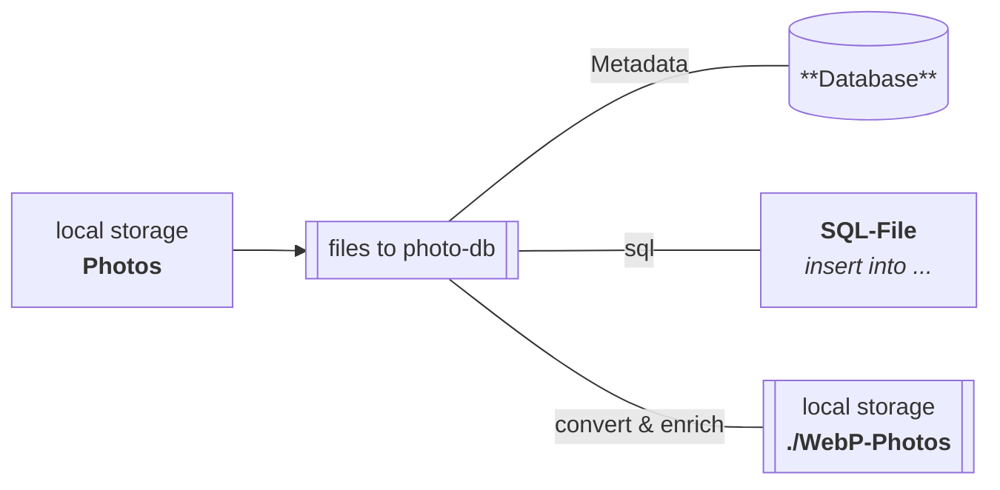
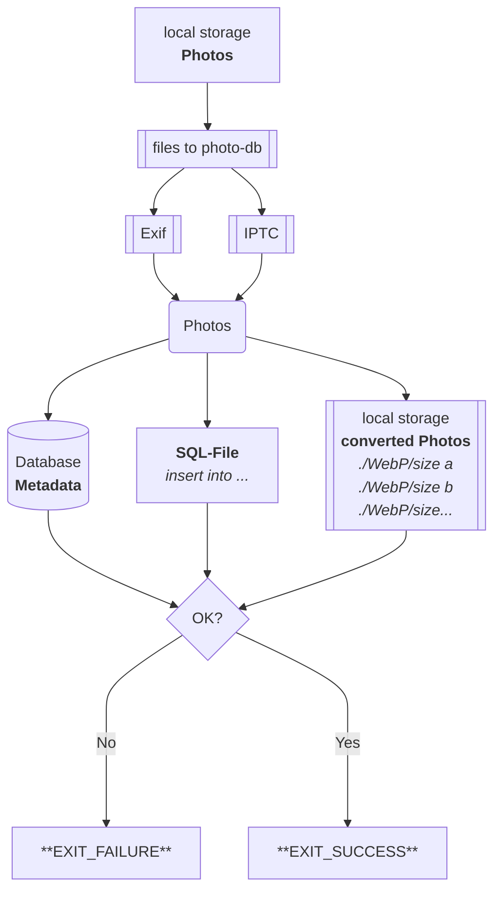
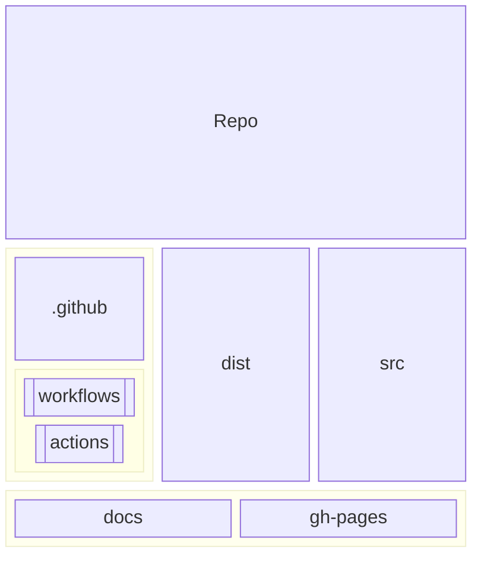
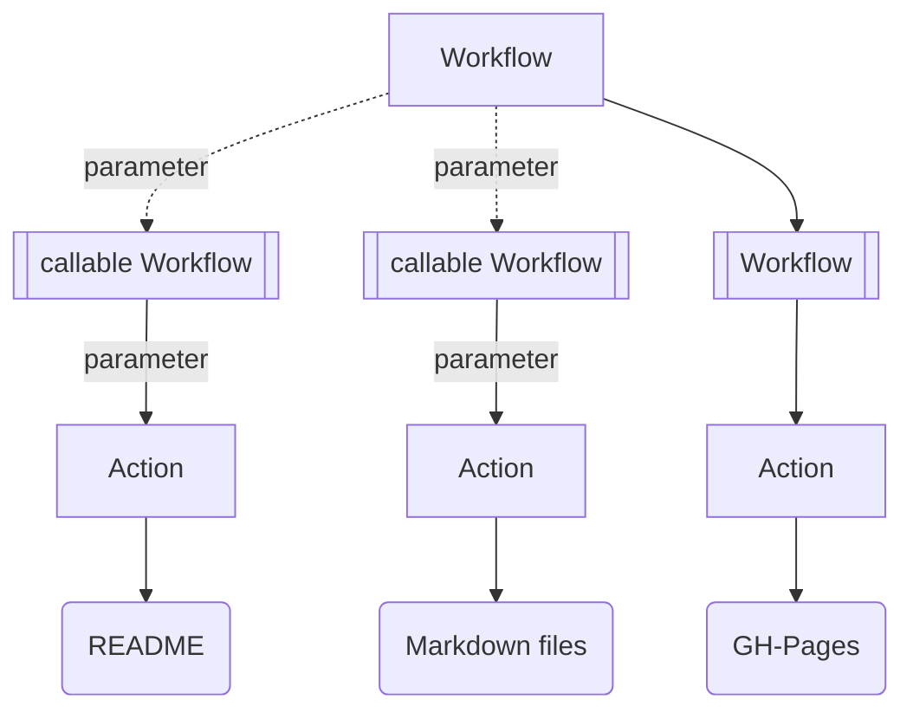
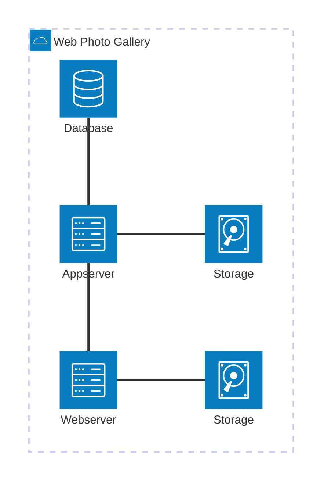

<div id="top" align="center">
<h1>files_photo-gallery</h1>

<p>QT6 CXX20 console app to convert photos and add Metadata to Database</p>

[Report Issue](https://github.com/Zheng-Bote/qt_files_photo-gallery/issues) [Request Feature](https://github.com/Zheng-Bote/qt_files_photo-gallery/pulls)

[](https://choosealicense.com/licenses/mit/)


</div>

<hr>

<!-- START doctoc generated TOC please keep comment here to allow auto update -->
<!-- DON'T EDIT THIS SECTION, INSTEAD RE-RUN doctoc TO UPDATE -->
**Table of Contents**

- [Description](#description)
    - [Features](#features)
  - [Status](#status)
    - [Application / Tool](#application--tool)
    - [Documentation](#documentation)
      - [README](#readme)
      - [other Markdown files](#other-markdown-files)
- [Installation](#installation)
  - [Dependencies](#dependencies)
    - [Conan](#conan)
    - [CMake](#cmake)
    - [Doxygen](#doxygen)
      - [Doxygen Awesome](#doxygen-awesome)
    - [QT](#qt)
    - [cxxopts](#cxxopts)
    - [inifile-cpp](#inifile-cpp)
    - [plog](#plog)
  - [folder structure](#folder-structure)
  - [Build](#build)
    - [QT](#qt-1)
    - [manually](#manually)
      - [Linux, macOS](#linux-macos)
  - [Packaging](#packaging)
    - [Linux, macOS](#linux-macos-1)
  - [Install](#install)
    - [Binaries](#binaries)
    - [manually](#manually-1)
      - [Linux, macOS](#linux-macos-2)
- [API Reference](#api-reference)
  - [Inputs / Parameters](#inputs--parameters)
  - [Outputs](#outputs)
- [Documentation](#documentation-1)
  - [Architecture](#architecture)
    - [Github](#github)
      - [Github Repo](#github-repo)
      - [Github Actions / Workflows](#github-actions--workflows)
    - [Application](#application)
      - [bounded context](#bounded-context)
      - [data import](#data-import)
  - [Usage/Examples/Tests](#usageexamplestests)
    - [Usage](#usage)
    - [Example Inifile](#example-inifile)
  - [DevOps](#devops)
    - [SHA256 Checksum](#sha256-checksum)
      - [Linux](#linux)
      - [MacOS](#macos)
    - [Graphviz](#graphviz)
    - [Software Bill of Materials (SBoM)](#software-bill-of-materials-sbom)
- [Authors and License](#authors-and-license)
  - [License](#license)
  - [Authors](#authors)
    - [Code Contributors](#code-contributors)

<!-- END doctoc generated TOC please keep comment here to allow auto update -->

<hr>

# Description


QT6 CXX20 console app to convert photos, collect Exif/IPTC and add metadata to DB.

> The purpose of this tool is to run as a microservice to prepare photos for a web-based photo-gallery.

Photos are converted into different sizes in WebP format and the metadata is written into a database.

Any existing Exif and IPTC metadata is also taken into account.



### Features

- [x] supports PostgreSQL (insert)
- [x] supports SQLite3 (incl. create tables, indexes, triggers; insert)
- [x] supports exports to SQL-file ("native", system-independent SQL; insert)
- [ ] Exchangeable Image File Format (Exif; read, write; sql insert)
- [ ] IPTC-IIM (IPTC; read, write; sql insert)
- [ ] converts images to several WebP sizes
- [ ] (db) password encryption
- [ ] advanced-extra-super-ultra-special feature xyz

<br>

- [x] OSS and license
- [x] works as designed
- [ ] no bugs

<br>

- [x] some more or less usefull Github Actions for GH-repo, GH-pages, GH-wiki, CI/CD-Pipelines, Release-Mgmt.
- [x] Package-Manager: Conan
- [x] Buildsystem: CMake
- [x] Clang-Tidy (cppcoreguidelines-\*)
- [x] Documentation: Doxygen (modern style)
- [x] Installer: CMake
- [x] Packaging: CPack (IFW;DEB;ZIP;TBZ2;RPM)
- [x] graphical installer (QT6 IFW)
- [ ] portable application / runtime binaries (see Release)
- [x] SBOM included (static; also Linux shell commands; GH-Action in work)
- [ ] separation of documentation (general Readme - detailed `/docs/*`)
- [ ] configuration via YAML
- [x] configuration via INI file

<br>

- [ ] runs on DOS/Windows
- [x] runs on MacOS
- [x] runs on Linux
- [ ] runs on iOS
- [ ] runs on Android
- [ ] runs on HarmonyOS

<p align="right">(<a href="#top">back to top</a>)</p>

## Status

### Application / Tool


### Documentation

_see also:_ [Application Documentation](#documentation)

#### README

[](https://github.com/Zheng-Bote/qt_files_photo-gallery/actions/workflows/repo-create_tree_readme.yml)

[](https://github.com/Zheng-Bote/qt_files_photo-gallery/actions/workflows/repo-call_Readme.yml)

#### other Markdown files

[](https://github.com/Zheng-Bote/qt_files_photo-gallery/actions/workflows/repo-create_doctoc_md.yml)

create ToC in Markdown files in folders

- .github/actions/\*\*
- .github/workflows/\*\*
- dist/\*\*
- docs/\*\*

<p align="right">(<a href="#top">back to top</a>)</p>

# Installation

bla bla ... everything easy and green with No Code/Low code and without any costs

## Dependencies

_All licenses are therefore GPL-compatible._

### Conan

Conan, software package manager for C and C++ developers

[](https://github.com/conan-io/conan)
[](https://choosealicense.com/licenses/mit/)

### CMake

CMake: A Powerful Software Build System

[](https://github.com/conan-io/conan)
[](https://choosealicense.com/licenses/bsd-3-clause/)

### Doxygen

Code Documentation. Automated.

[](https://github.com/doxygen/doxygen)
[](https://choosealicense.com/licenses/gpl-2.0/)

#### Doxygen Awesome

Doxygen Awesome is a custom CSS theme for Doxygen HTML documentation.

This theme is an attempt to update the visuals of Doxygen without changing its overall layout too much.

[](https://github.com/jothepro/doxygen-awesome-css)
[](https://choosealicense.com/licenses/mit/)

### QT

_QT6 - Community Edition_

The Qt framework contains a comprehensive set of highly intuitive and modularized C++ library classes and is loaded with APIs to simplify your application development. Qt produces highly readable, easily maintainable and reusable code with high runtime performance and small footprint – and it's cross-platform.

[](https://www.qt.io/download-open-source)
[](https://choosealicense.com/licenses/lgpl-3.0/) _see also:_[Obligations of the GPL and LGPL](https://www.qt.io/licensing/open-source-lgpl-obligations)

### cxxopts

a lightweight C++ option parser library, supporting the standard GNU style syntax for options.

[](https://github.com/jarro2783/cxxopts)
[](https://choosealicense.com/licenses/mit/)

> \[!NOTE]
> managed via the package manager [](https://conan.io/center/recipes/cxxopts)

### inifile-cpp

inifile-cpp is a simple and easy to use single header-only ini file en- and decoder for C++.

[](https://github.com/Rookfighter/inifile-cpp)
[](https://choosealicense.com/licenses/mit/)

> \[!NOTE]
> included in `src/includes`

### plog

Plog - portable, simple and extensible C++ logging library

[](https://github.com/SergiusTheBest/plog)
[](https://choosealicense.com/licenses/mit/)

> \[!NOTE]
> managed via the package manager [](https://conan.io/center/recipes/plog)

## folder structure

<!-- readme-tree start -->

```
.
├── .github
│   ├── actions
│   │   └── doctoc
│   │       ├── README.md
│   │       ├── action.yml
│   │       └── dist
│   │           ├── index.js
│   │           ├── index.js.map
│   │           ├── licenses.txt
│   │           └── sourcemap-register.js
│   └── workflows
│       ├── repo-actions_docu.yml
│       ├── repo-call_Readme.yml
│       ├── repo-create_doctoc.yml_
│       ├── repo-create_doctoc_md.yml
│       ├── repo-create_tree_readme.yml
│       └── repo-test_sbom.yml
├── .gitignore
├── LICENSE
├── README.md
├── dist
│   ├── README.md
│   ├── atom_usages_v0.1.5.json
│   ├── main.cpp_v0.1.4.svg
│   ├── qt_files_photo-gallery.ini
│   ├── sbom_v0.1.5.json
│   └── screenshot_graphical-installer_de.png
├── src
│   ├── CMAKEGraphVizOptions.cmake
│   ├── CMakeFiles
│   │   ├── ClangTidy.cmake
│   │   ├── Doxygen.cmake
│   │   ├── cmake.check_cache
│   │   └── extra_headers
│   ├── CMakeLists.txt
│   ├── CMakeUserPresets.json
│   ├── conanfile.txt
│   ├── configure
│   │   └── rz_config.h.in
│   ├── includes
│   │   ├── inicpp.h
│   │   ├── qaesencryption.cpp
│   │   ├── qaesencryption.h
│   │   ├── rz_aes.cpp
│   │   ├── rz_aes.h
│   │   ├── rz_datetime.cpp
│   │   ├── rz_datetime.h
│   │   ├── rz_inifile.cpp
│   │   ├── rz_inifile.h
│   │   ├── rz_pg_db.cpp
│   │   ├── rz_pg_db.h
│   │   ├── rz_readdir.cpp
│   │   ├── rz_readdir.h
│   │   ├── rz_sqlite3_db.cpp
│   │   └── rz_sqlite3_db.h
│   └── main.cpp
└── tree.bak

10 directories, 47 files
```

<!-- readme-tree end -->

<p align="right">(<a href="#top">back to top</a>)</p>

## Build

### QT

_QT6_

just load the project in QT Creator and run build <debug> or <release...>

### manually

#### Linux, macOS

```Shell
cd src

conan install . --output-folder=../build --build=missing

cd ../build

cmake -S ../src -B . -G "Unix Makefiles" -DCMAKE_TOOLCHAIN_FILE=conan_toolchain.cmake  -DCMAKE_POLICY_DEFAULT_CMP0091=NEW -DCMAKE_BUILD_TYPE=Release

# cmake --build . --parallel <number of CPU cores>
cmake --build .
```

> [!NOTE]
> generate Doxygen documentation with `cd build && cmake --build . --target doxygen`

<p align="right">(<a href="#top">back to top</a>)</p>

## Packaging

### Linux, macOS

```Bash
cd build && sudo cpack -G "ZIP;DEB;RPM" -B packages
# or
cd build && sudo cmake --build . --target package
```

```Bash
cd build && sudo cmake --build . --target  package_source
```

## Install

### Binaries

depends on your system

```Bash
rpm -i files_photo-gallery-0.1.5-Linux.rpm

dpkg -i files_photo-gallery-0.1.5-Linux.deb

unzip files_photo-gallery-0.1.5-Linux.zip

....

# graphical installer (QT6 IFW)
./files_photo-gallery-0.1.5-Linux.run
```

### manually

#### Linux, macOS

Installing the binary and all necessary dependency libs:

```Bash
cd build && sudo cmake --install .
```

# API Reference

> \[!IMPORTANT]
> still under construction.

## Inputs / Parameters

> [!NOTE]
> at least 1 parameter is required

- `-a` or `-i <path to>/<ini file>`
- use `-a` for shortcut
- use `-a -e <env>` for shortcut
- use `-i <path to>/<ini file>`
- use `-i <path to>/<ini file> -e <env>`

> \[!IMPORTANT]
> still under construction.

| Parameter      | Type     | Description                                                                               |
| :------------- | :------- | :---------------------------------------------------------------------------------------- |
| `-a --auto`    | `none`   | _Optional:_ load Ini `<program path>/<program>.ini>`                                      |
| `-c --create`  | `string` | _Optional:_ create Ini `<path to>/<file.ini>` or default: `<program path>/<program>.ini>` |
| `-e --env`     | `string` | _Optional:_ `<dev> , <ini> , <prod>`or default:`dev`                                      |
| `-i --ini`     | `string` | _Optional:_ `<pathTo/inifile>`                                                            |
| `-l --listini` | `string` | _Optional:_ `<pathTo/inifile>` or default: `<program path>/<program>.ini>`                |
| `-v --version` | `none`   | _Optional:_ `<program>-<major>.<minor>.<patch>`                                           |
| `-h --help`    | `none`   | _Optional:_ list help menu                                                                |

## Outputs

- `exit(EXIT_SUCCESS)` or `exit(EXIT_FAILURE)`

- PostgreSQL: inserted rows
- SQLite3: created tables, indexes, triggers; inserted rows
- SQL-File: created file with sql inserts



<p align="right">(<a href="#top">back to top</a>)</p>

# Documentation

> \[!IMPORTANT]
> documentation is still under construction.

see also folder: [dist](./dist/)

> [!NOTE]
> generate Doxygen documentation with `cd build && cmake --build . --target doxygen`

_under constrcution:_

[](https://www.github.com/Zheng-Bote)

## Architecture

### Github

#### Github Repo



#### Github Actions / Workflows



<p align="right">(<a href="#top">back to top</a>)</p>

### Application

#### bounded context

- Webserver NGinx
- Appserver (Applicationserver) Rust Rocket
- Database PostgreSQL
- Storage (for Webserver static content as well as for Appserver Photo-Gallery management)



#### data import

- collecting local files
- read attributes (size, geometry)
- read Exif/IPTC (if present)
- write Metadata to DB|SQL-File
- convert files to WebP


## Usage/Examples/Tests

### Usage

> [!NOTE]
> at least 1 parameter is required:
> `-a` or `-i <path to>/<ini file>`

> [!TIP]
> use `-a` for shortcut
> use `-a -e <env>` for shortcut
> use `-i <path to>/<ini file>`
> use `-i <path to>/<ini file> -e <env>`

<p align="right">(<a href="#top">back to top</a>)</p>

### Example Inifile

see also: `<prog> -c` : create Inifile

```Ini
[DB_dev]
enabled=true                      # <true> | <false>
rdbms=file                        # <pg> | <sqlite> | <file>
dbname=                           # empty if file
dbfile=                           # empty if file
hostname=                         # empty if file
password=                         # empty if file
port=                             # empty if file
username=                         # empty if file
sql_file=./qt_files_photo.sql     # <path/to/file.sql>

[DB_int]
enabled=true                      # <true> | <false>
rdbms=sqlite                      # <pg> | <sqlite> | <file>
dbname=                           # empty if sqlite
dbfile=./photo_gallery.sqlite     # <path/to/sqlite.db>
hostname=                         # empty if sqlite
password=                         # empty if sqlite
port=                             # empty if sqlite
username=                         # empty if sqlite
sql_to_file=                      # empty if sqlite

[DB_prod]
enabled=true                      # <true> | <false>
rdbms=pg                          # <pg> | <sqlite> | <file>
dbname=photo_gallery              # <my database>
dbfile=                           # empty if pg
hostname=rdbms_srv                # <database server> // IP-Address or FQDN
password=Top_Secret!              # <database user password>
port=8154                         # <database server port>
username=photo_rw_user            # <database user>
sql_to_file=                      # empty if pg


[APP_dev]
Logifle=./qt_files_photo.log      # <path/to/logfile.log>

[APP_int]
Logifle=./qt_files_photo.log      # <path/to/logfile.log>

[APP_prod]
Logifle=./qt_files_photo.log      # <path/to/logfile.log>
```

<p align="right">(<a href="#top">back to top</a>)</p>

## DevOps

### SHA256 Checksum

during build a SHA2-256 checksum is generated and stored

> [!NOTE]
> see `build/qt_files_photo-gallery.sha256sum`

#### Linux

**generate**

```Bash
sha256sum qt_files_photo-gallery > qt_files_photo-gallery.sha256sum
```

**check**

```Bash
sha256sum --check qt_files_photo-gallery.sha256sum
```

#### MacOS

**generate**

```Bash
shasum -a 256 qt_files_photo-gallery > qt_files_photo-gallery.sha256sum
```

**check**

```Bash
shasum --check qt_files_photo-gallery.sha256sum
```

### Graphviz

> [!TIP]
> create a file `src/CMAKEGraphVizOptions.cmake`

content of `CMAKEGraphVizOptions.cmake`:
`set(GRAPHVIZ_CUSTOM_TARGETS TRUE)`

```Bash
cd ../build
cmake --graphviz=qt_files_photo-gallery.dot .
```

goto `https://dreampuf.github.io/GraphvizOnline/` and fill in the content of file `qt_files_photo-gallery.dot`

### Software Bill of Materials (SBoM)

> [!NOTE]
> A Github Action/Workflow to produce a SPDX/CycloneDX JSON SBoM during Release, is still under construction.

```Bash
nvm use --lts

atom -J-Xmx16g usages -o app.atom --slice-outfile ./dist/atom_usages_v0.1.0.json -l cpp ./src

cdxgen -o ./dist/sbom_v0.1.0.json -t cpp --usages-slices-file ./dist/atom_usages_v0.1.0.json --author "ZHENG Robert" --deep -r ./src
```

<p align="right">(<a href="#top">back to top</a>)</p>

# Authors and License

## License

[](https://choosealicense.com/licenses/mit/)

Copyright (c) 2024 ZHENG Robert

Permission is hereby granted, free of charge, to any person obtaining a copy
of this software and associated documentation files (the "Software"), to deal
in the Software without restriction, including without limitation the rights
to use, copy, modify, merge, publish, distribute, sublicense, and/or sell
copies of the Software, and to permit persons to whom the Software is
furnished to do so, subject to the following conditions:

The above copyright notice and this permission notice shall be included in all
copies or substantial portions of the Software.

THE SOFTWARE IS PROVIDED "AS IS", WITHOUT WARRANTY OF ANY KIND, EXPRESS OR
IMPLIED, INCLUDING BUT NOT LIMITED TO THE WARRANTIES OF MERCHANTABILITY,
FITNESS FOR A PARTICULAR PURPOSE AND NONINFRINGEMENT. IN NO EVENT SHALL THE
AUTHORS OR COPYRIGHT HOLDERS BE LIABLE FOR ANY CLAIM, DAMAGES OR OTHER
LIABILITY, WHETHER IN AN ACTION OF CONTRACT, TORT OR OTHERWISE, ARISING FROM,
OUT OF OR IN CONNECTION WITH THE SOFTWARE OR THE USE OR OTHER DEALINGS IN THE
SOFTWARE.

        https://choosealicense.com/licenses/mit/

## Authors

- [](https://www.github.com/Zheng-Bote)

### Code Contributors


[](https://www.github.com/Zheng-Bote)

<hr>

:vulcan_salute:

<p align="right">(<a href="#top">back to top</a>)</p>
