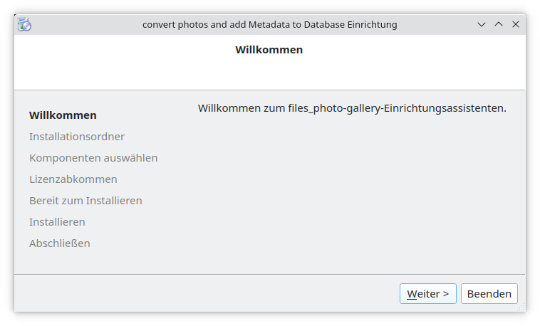

<div id="top" align="center">
<h1>dist folder</h1>

<p>`dist` folder of `qt_files_photo-gallery`</p>

</div>

<hr>

<!-- START doctoc generated TOC please keep comment here to allow auto update -->
<!-- DON'T EDIT THIS SECTION, INSTEAD RE-RUN doctoc TO UPDATE -->
**Table of Contents**

- [Description](#description)
- [graphical installer](#graphical-installer)
- [main.cpp dependencies](#maincpp-dependencies)
- [Software Bill of Materils (SBoM)](#software-bill-of-materils-sbom)
- [example ini-file](#example-ini-file)

<!-- END doctoc generated TOC please keep comment here to allow auto update -->

<hr>

# Description

The `dist` folder provides tools, apps and example config-files

# graphical installer



# main.cpp dependencies


# Software Bill of Materils (SBoM)

current SBoM see:

- sbom_v0.1.5.json

# example ini-file

Example Ini-file _qt_files_photo-gallery.ini_ for `qt_files_photo-gallery`

```Ini
[DB_dev]
enabled=true                      # <true> | <false>
rdbms=file                        # <pg> | <sqlite> | <file>
dbname=                           # empty if file
dbfile=                           # empty if file
hostname=                         # empty if file
password=                         # empty if file
port=                             # empty if file
username=                         # empty if file
sql_file=./qt_files_photo.sql     # <path/to/file.sql>

[DB_int]
enabled=true                      # <true> | <false>
rdbms=sqlite                      # <pg> | <sqlite> | <file>
dbname=                           # empty if sqlite
dbfile=./photo_gallery.sqlite     # <path/to/sqlite.db>
hostname=                         # empty if sqlite
password=                         # empty if sqlite
port=                             # empty if sqlite
username=                         # empty if sqlite
sql_to_file=                      # empty if sqlite

[DB_prod]
enabled=true                      # <true> | <false>
rdbms=pg                          # <pg> | <sqlite> | <file>
dbname=photo_gallery              # <my database>
dbfile=                           # empty if pg
hostname=rdbms_srv                # <database server> // IP-Address or FQDN
password=Top_Secret!              # <database user password>
port=8154                         # <database server port>
username=photo_rw_user            # <database user>
sql_to_file=                      # empty if pg


[APP_dev]
Logifle=./qt_files_photo.log      # <path/to/logfile.log>

[APP_int]
Logifle=./qt_files_photo.log      # <path/to/logfile.log>

[APP_prod]
Logifle=./qt_files_photo.log      # <path/to/logfile.log>
```

<p align="right">(<a href="#top">back to top</a>)</p>
