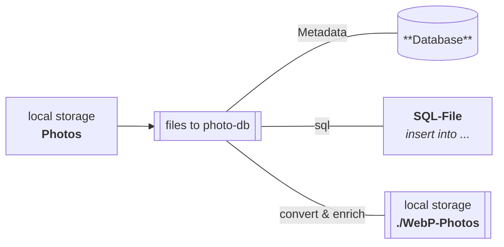

> QT6 CXX20 console app to convert photos and add Metadata to Database

# Description

QT6 CXX20 console app to convert photos, collect Exif/IPTC and add metadata to DB.

> The purpose of this tool is to run as a microservice to prepare photos for a web-based photo-gallery.

Photos are converted into different sizes in WebP format and the metadata is written into a database.

Any existing Exif and IPTC metadata is also taken into account.

        <ol>
          <li><a href="#">Viennoiseries</a></li>
          <li><a href="#">Tartelettes</a></li>
          <li><a href="#">Aux mûres</a></li>
        </ol>
