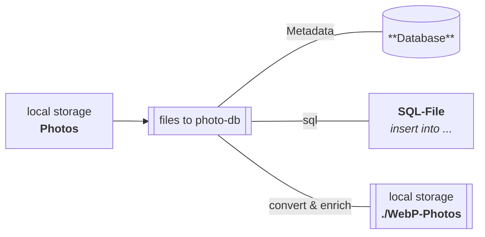

<h1>files_photo-gallery</h1>

QT6 CXX20 console app to convert photos and add Metadata to Database

[Report Issue](https://github.com/Zheng-Bote/qt_files_photo-gallery/issues) [Request Feature](https://github.com/Zheng-Bote/qt_files_photo-gallery/pulls)

<!-- START doctoc generated TOC please keep comment here to allow auto update -->
<!-- DON'T EDIT THIS SECTION, INSTEAD RE-RUN doctoc TO UPDATE -->

**Table of Contents**

- [Description](#description)
  - [Features](#features)

<!-- END doctoc generated TOC please keep comment here to allow auto update -->

# Description

QT6 CXX20 console app to convert photos, collect Exif/IPTC and add metadata to DB.

> The purpose of this tool is to run as a microservice to prepare photos for a web-based photo-gallery.

Photos are converted into different sizes in WebP format and the metadata is written into a database.

Any existing Exif and IPTC metadata is also taken into account.

### Features

- [x] supports PostgreSQL (insert)
- [x] supports SQLite3 (incl. create tables, indexes, triggers; insert)
- [x] supports exports to SQL-file ("native", system-independent SQL; insert)
- [ ] Exchangeable Image File Format (Exif; read, write; sql insert)
- [ ] IPTC-IIM (IPTC; read, write; sql insert)
- [ ] converts images to several WebP sizes
- [ ] (db) password encryption
- [ ] advanced-extra-super-ultra-special feature xyz

 

- [x] OSS and license
- [x] works as designed
- [ ] no bugs

 

- [x] some more or less usefull Github Actions for GH-repo, GH-pages, GH-wiki, CI/CD-Pipelines, Release-Mgmt.
- [x] Package-Manager: Conan
- [x] Buildsystem: CMake
- [x] Clang-Tidy (cppcoreguidelines-\*)
- [x] Documentation: Doxygen (modern style)
- [x] Installer: CMake
- [x] Packaging: CPack (IFW;DEB;ZIP;TBZ2;RPM)
- [x] graphical installer (QT6 IFW)
- [ ] portable application / runtime binaries (see Release)
- [x] SBOM included (static; also Linux shell commands; GH-Action in work)
- [ ] separation of documentation (general Readme - detailed `/docs/*`)
- [ ] configuration via YAML
- [x] configuration via INI file

 

- [ ] runs on DOS/Windows
- [x] runs on MacOS
- [x] runs on Linux
- [ ] runs on iOS
- [ ] runs on Android
- [ ] runs on HarmonyOS

(<a href="#top">back to top</a>)

